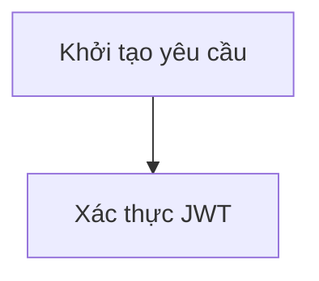
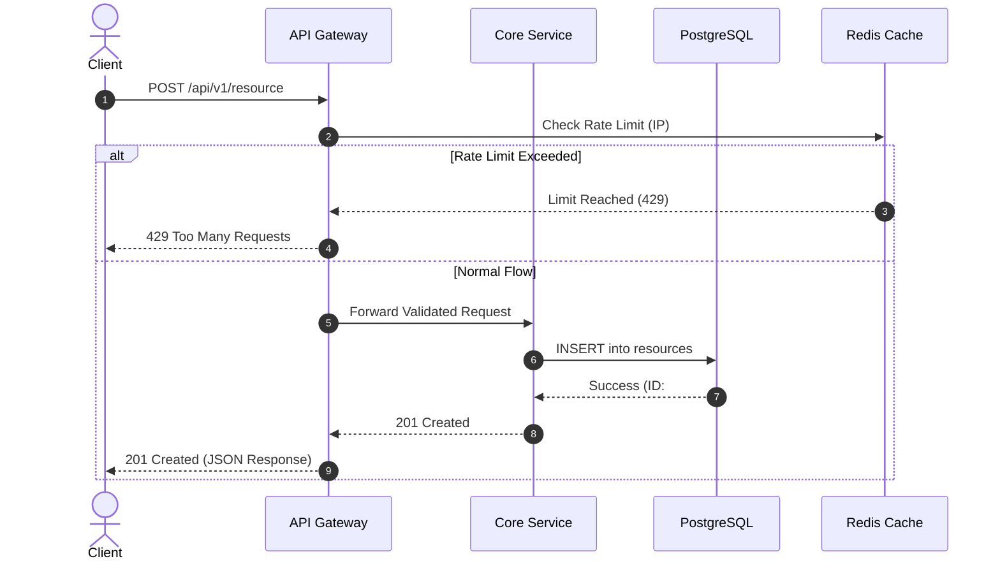

# Kỹ Năng: Thiết Kế Sơ Đồ Mermaid Chuẩn An Toàn (`mermaid-design`)

Kỹ năng này hướng dẫn Agent cách dựng các sơ đồ Mermaid chuyên nghiệp, đảm bảo hiển thị 100% không bị lỗi cú pháp ("Syntax error in text") và tương thích hoàn hảo với bộ giải mã của Spec UI Docsify Portal.

---

## Bộ Quy Tắc Cú Pháp An Toàn (Zero-Error Rules)

### 1. Tuyệt Đối Không Dùng Mũi Tên Ngược

Trong Mermaid Flowchart, cú pháp mũi tên ngược (`<-` hoặc `<--`) rất dễ gây lỗi parser.

- ❌ **Sai**: `A <-- B : Callback`
- ✅ **Đúng**: `B --> A : Callback` (Đảo chiều vị trí hai nút và dùng mũi tên xuôi).

### 2. Luôn Bọc Nhãn Ký Tự Đặc Biệt Trong Nháy Kép

Bất cứ nhãn nút nào chứa ký tự như `/`, `:`, `(`, `)`, `-`, `&`, `"`, hoặc khoảng trắng dài đều phải bọc trong cặp nháy kép `["..."]`.

- ❌ **Sai**: `AuthNode[POST /api/v1/login (Auth)]`
- ✅ **Đúng**: `AuthNode["POST /api/v1/login (Auth)"]`

### 3. Định Dạng Khối Sơ Đồ Tiêu Chuẩn

Trình biên dịch của Docsify trong `index.html` tự động nhận diện và bọc mọi khối ` ```mermaid ` vào thẻ `<div class="diagram-wrapper">` với đầy đủ tính năng:

- Co vừa khung (Fit-to-Frame) không bị tràn ngang hay cắt xén.
- Tích hợp thanh công cụ Smart Toolbar (Zoom in, Zoom out, Reset 1:1, Copy mã, Xuất SVG, PNG).
- Kích hoạt chế độ phóng to toàn màn hình (Fullscreen Modal chuẩn Figma/Miro).

Vì vậy, chỉ cần viết khối mã Markdown tiêu chuẩn:

````markdown

````

---

## Mẫu Bảng Màu Spec UI Cho Mermaid (Spec UI Theme Palette)

Thêm các định nghĩa `classDef` sau vào cuối sơ đồ để sơ đồ đồng bộ tuyệt đối với bảng màu Terracotta của hệ thống:

```mermaid
flowchart TD
    classDef client fill:#f5ebe6,stroke:#c65a3a,stroke-width:1.5px,color:#2c2623;
    classDef service fill:#eef2f6,stroke:#2b6cb0,stroke-width:1.5px,color:#1a202c;
    classDef database fill:#fbf0ea,stroke:#9f3f2a,stroke-width:2px,color:#2c2623;
    classDef cache fill:#fef3c7,stroke:#d97706,stroke-width:1.5px,color:#78350f;
    classDef external fill:#f1f5f9,stroke:#64748b,stroke-width:1.5px,stroke-dasharray: 4 4,color:#334155;
```

---

## Mẫu Sơ Đồ Trình Tự Chuẩn (Standard Sequence Template)

````markdown

````
