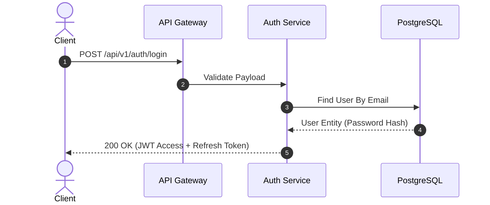

# Kỹ Năng: Soạn Thảo Đặc Tả Kỹ Thuật Chuẩn Spec UI (`spec-authoring`)

Kỹ năng này hướng dẫn Agent cách soạn thảo từng tệp tài liệu markdown `.md` cho một module chức năng cụ thể, tuân thủ nghiêm ngặt **Cấu trúc 5 Phần Bắt Buộc** và hệ thống thành phần giao diện của Spec UI.

---

## Cấu Trúc 5 Phần Bắt Buộc Của Một Tệp Đặc Tả

Mỗi tệp tài liệu module `.md` được tạo ra phải bao gồm đầy đủ 5 phần theo thứ tự sau:

### Phần 1: Header Module & Thông Tin Phiên Bản

- Tiêu đề cấp 1 (`# Tên Module / Tính Năng`).
- Hàng nhãn trạng thái và phương thức:
  ```html
  <span class="status-label stable">Hoạt động ổn định</span>
  <span class="badge post">POST</span>
  ```
- Đoạn tóm tắt mục tiêu nghiệp vụ (1–2 câu súc tích).

### Phần 2: Luồng Nghiệp Vụ & Logic Ngầm (Hidden Logic & Edge Cases)

- Giải thích các bước xử lý logic chính từ lúc nhận request đến khi hoàn tất.
- **Bắt buộc phân tích các Logic ngầm**:
  - Điều kiện rẽ nhánh đặc thù.
  - Cơ chế bảo mật ngầm (Token validation, bcrypt/argon2 hashing, salt, PKCE).
  - Quy định Rate Limiting (ví dụ: tối đa 5 lần đăng nhập sai trong 15 phút).
  - Transaction isolation và rollback conditions.
- Tích hợp Callout cảnh báo rủi ro hoặc lưu ý kiến trúc:
  ```html
  <div class="callout warning">
    <i class="ti ti-alert-triangle"></i> <strong>Lưu ý bảo mật & Rate Limiting:</strong> Nếu người dùng nhập sai mật khẩu quá 5 lần liên tiếp, hệ thống sẽ tự động khóa tài khoản tạm thời trong 15 phút qua Redis key với TTL 900s.
  </div>
  ```

### Phần 3: Sơ Đồ Kiến Trúc Hoặc Luồng Trình Tự (Architecture / Flow Diagram)

- Sử dụng sơ đồ Mermaid trực quan (Sequence diagram cho API hoặc Flowchart cho luồng rẽ nhánh).
- Sử dụng khối mã markdown chuẩn ` ```mermaid ` (trình biên dịch Docsify tự động bọc thẻ `diagram-wrapper` và kích hoạt đầy đủ tính năng tương tác):

````markdown

````

### Phần 4: Bảng Đặc Tả Dữ Liệu & Tham Số Kỹ Thuật (Data Dictionary & Tech Table)

- Lập bảng chi tiết các tham số Request Header, Query, Path, Body và Response Payload.
- Sử dụng bảng Markdown kết hợp `<span class="required-star">*</span>`:
  ```markdown
  | Tên trường | Kiểu dữ liệu | Bắt buộc | Mặc định | Mô tả & Ràng buộc |
  | :--- | :--- | :---: | :--- | :--- |
  | `email` | `string` | Có<span class="required-star">*</span> | - | Địa chỉ email RFC 5322 hợp lệ, độ dài tối đa 255 ký tự. |
  | `password` | `string` | Có<span class="required-star">*</span> | - | Tối thiểu 8 ký tự, gồm ít nhất 1 chữ hoa, 1 số và 1 ký tự đặc biệt. |
  | `remember_me` | `boolean` | Không | `false` | Nếu `true`, Refresh Token có hạn 30 ngày (thay vì 1 ngày). |
  ```

### Phần 5: Hướng Dẫn Triển Khai & Code Snippet / Migration Guide

- Cung cấp mã nguồn thực tế hoặc ví dụ JSON response / cấu hình môi trường đặt trong PrismJS code blocks:
  ```json
  {
    "status": "success",
    "code": 200,
    "data": {
      "access_token": "eyJhbGciOi...",
      "token_type": "Bearer",
      "expires_in": 3600
    }
  }
  ```
- Nếu có so sánh (Trước vs Sau hoặc Legacy vs Modern), có thể sử dụng cấu trúc Docsify Tabs:
  ````markdown
  <!-- tabs:start -->
  #### **Hệ Thống Cũ**
  ```typescript
  // Legacy code
  ```
  #### **Hệ Thống Mới**
  ```typescript
  // Modern code
  ```
  <!-- tabs:end -->
  ````

---

## Những Điều Cần Tránh Khi Soạn Thảo

1. Không dùng inline CSS (`style="..."`).
2. Không viết nội dung chung chung không có giá trị kỹ thuật.
3. Không để sót lỗi chưa được giải thích (luôn liệt kê mã lỗi HTTP 400, 401, 403, 404, 429, 500).
4. **Không dùng emoji trong tiêu đề (H1, H2, H3)**: Giữ typography sạch sẽ, chỉ sử dụng Tabler Icons (`<i class="ti ti-..."></i>`) cho mục đích công năng.
