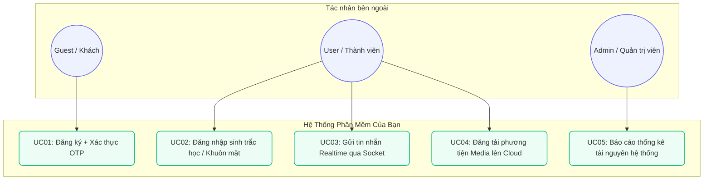
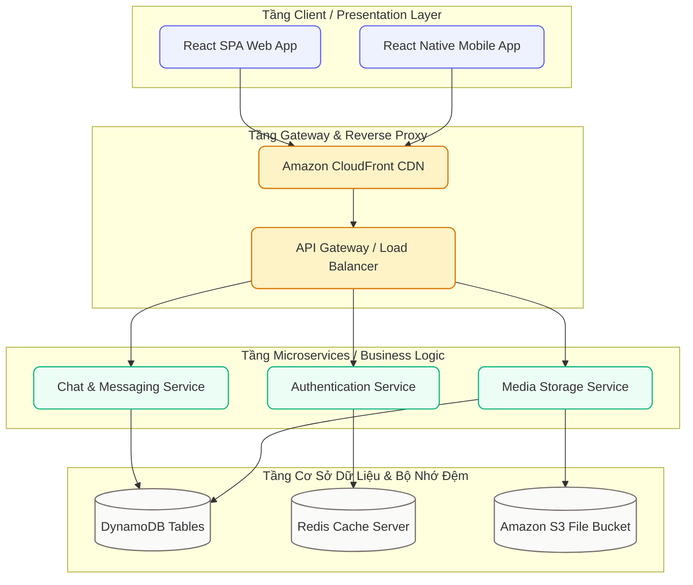
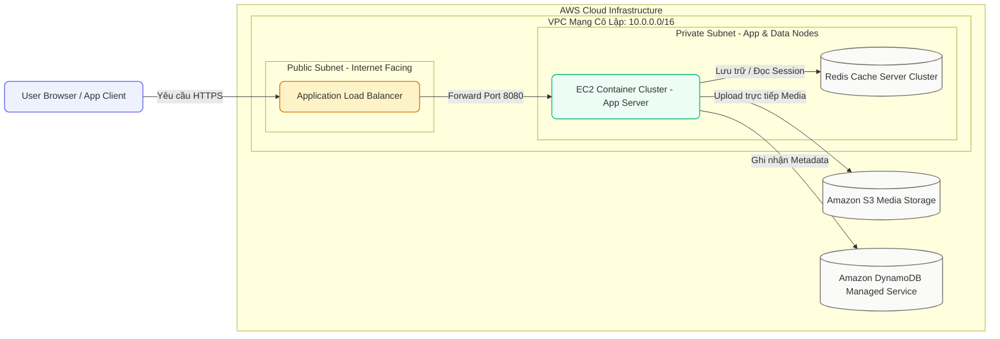
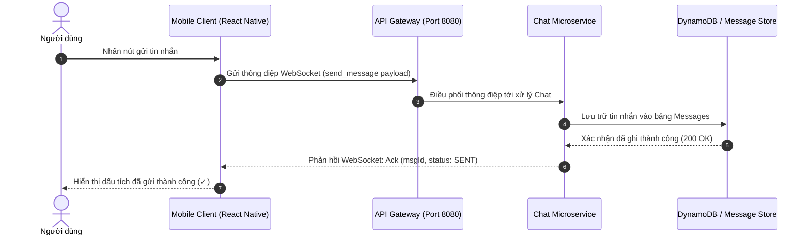
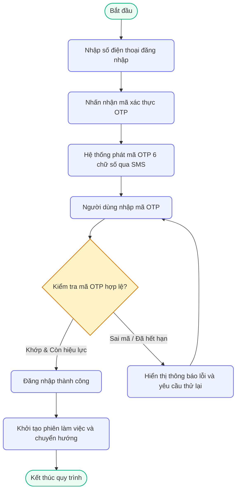

# Thư Viện 5 Mẫu Sơ Đồ Mermaid Chuẩn Hóa

Mermaid Engine v10 (Fit-to-Frame 100%)

Tất cả các sơ đồ dưới đây đều được tích hợp tự động với bộ tính năng **Mermaid Pro Interactive Suite**:

- **Interactive Node Focus & Path Highlight**: Click vào bất kỳ node nào để làm sáng rõ nút đó cùng luồng kết nối và các nút láng giềng liên quan; các thành phần ngoại lai tự động mờ nhẹ.
- **Xuất ảnh Vector & Raster**: Tải trực tiếp file `.svg` sắc nét hoặc ảnh `.png` chất lượng cao 2x Retina có sẵn nền sáng chuẩn.
- **Sao chép mã nguồn 1-click**: Nút "Sao chép mã" trực tiếp trên toolbar giúp lấy nhanh cú pháp Mermaid gốc.
- **Thanh công cụ Smart Toolbar**: Nút chuyển đổi 1-click giữa **Xem 1:1** và **Thu vừa khung**, kết hợp **Thao tác nhấp đúp (Double-Click)**.
- **Fullscreen Modal chuẩn Figma/Miro**: Phóng to/thu nhỏ bằng cuộn chuột, lia sơ đồ (Pan), thanh chọn tỉ lệ nhanh **Preset Zoom** (`Fit`, `50%`, `100%`, `150%`, `200%`), chế độ **Toàn màn hình Native (F11)**, phím tắt `Esc`, `+`, `-`, `0`, `1`, `2`, `5`, `F`.

---

## 1. Mẫu 1: Sơ Đồ Trường Hợp Sử Dụng (Use Case Diagram)

Phù hợp cho việc mô tả các tác nhân bên ngoài (Actors) và các chức năng chính của hệ thống.

Hình 1.1: Sơ đồ Use Case tổng quát phân quyền theo tác nhân

---

## 2. Mẫu 2: Sơ Đồ Kiến Trúc 3 Tầng (3-Layer Architecture Diagram)

Phù hợp cho việc biểu diễn phân tầng Presentation, Gateway, Microservices và Data Storage.

Hình 1.2: Kiến trúc 3 tầng tổng thể của hệ thống phân tán

---

## 3. Mẫu 3: Sơ Đồ Triển Khai Hạ Tầng Mạng (Deployment Diagram trên AWS)

Phù hợp cho việc mô tả cấu hình VPC, Public/Private Subnet, cân bằng tải và bảo mật máy chủ.

Hình 1.3: Sơ đồ triển khai hạ tầng vật lý trên Amazon Web Services

---

## 4. Mẫu 4: Sơ Đồ Trình Tự Giao Tiếp Mạng (WebSocket Sequence Diagram)

Phù hợp cho việc biểu diễn các tương tác tuần tự thời gian thực giữa Người dùng, Client, Gateway và Microservices.

Hình 1.4: Trình tự xử lý gửi tin nhắn thời gian thực qua WebSocket

---

## 5. Mẫu 5: Sơ Đồ Hoạt Động Rẽ Nhánh Logic (Activity Diagram - OTP SMS)

Phù hợp cho việc biểu diễn logic nghiệp vụ, các bước kiểm tra điều kiện và xử lý lỗi.

Hình 1.5: Sơ đồ luồng hoạt động đăng nhập qua mã xác thực OTP SMS

