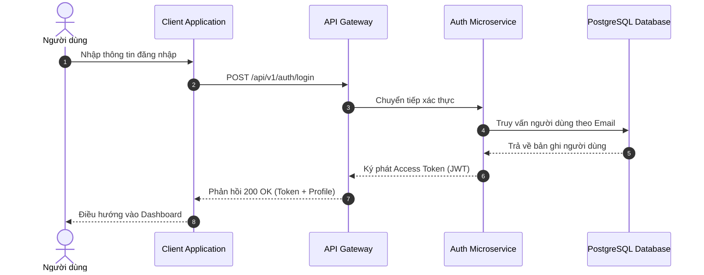

# Hướng Dẫn Dành Cho AI: Quy Trình Phân Tích Codebase & Viết Tài Liệu Spec UI System

# (AI Codebase Analyzer & Technical Documentation Specification Guide)

Tài liệu này là **Master Prompt & Blueprint** dành cho các trợ lý lập trình trí tuệ nhân tạo (AI Coding Assistants: Cursor, Claude, ChatGPT, Gemini, Copilot...). Khi bạn được giao nhiệm vụ khảo sát một dự án mã nguồn bất kỳ và viết tài liệu đặc tả kiến trúc/hệ thống, bạn **BẮT BUỘC** phải tuân thủ nghiêm ngặt quy trình và các tiêu chuẩn định dạng dưới đây.

---

## 1. Nguyên Tắc Cốt Lõi (Core Principles)

1. **Ngôn ngữ & Giọng văn**: Sử dụng Tiếng Việt kỹ thuật chuyên nghiệp, chuẩn mực, rõ ràng, gãy gọn; giữ nguyên các thuật ngữ chuyên ngành chuẩn tiếng Anh (e.g. _Middleware, Dependency Injection, State Management, JWT, Idempotency, Single Source of Truth_).
2. **Tập trung vào "Logic Ngầm" (Hidden Business Logic)**: Không chỉ mô tả lại những gì hiển thị trên màn hình hoặc copy lại code hời hợt. AI phải đào sâu vào mã nguồn để bóc tách:
   - Các điều kiện rẽ nhánh phức tạp (Edge cases, validation rules).
   - Cơ chế bảo mật ngầm (Token signing, HMAC, Encryption, Hashing).
   - Luồng dữ liệu ngầm (Background jobs, event bus, database triggers, cache synchronization).
3. **Trực quan hóa 100% bằng Sơ đồ (Diagram First)**: Mọi chức năng chính hoặc luồng dữ liệu đều phải có sơ đồ Mermaid tương ứng bọc trong `<div class="diagram-wrapper">`.
4. **Chuẩn hóa thành phần (Component Consistency)**: Tuyệt đối tuân thủ hệ thống thẻ Spec UI (Callout, HTTP Badges, Status Labels, Tabs).
5. **Phong cách thiết kế "Non-AI" (Sạch sẽ, không Emoji)**: Tuyệt đối không chèn emoji hoạt hình vào tiêu đề các cấp (H1, H2, H3) và thanh điều hướng. Giữ typography sạch sẽ, nghiêm túc. Chỉ dùng Tabler Icons (`<i class="ti ti-..."></i>`) cho các thành phần công năng (Callouts, Badges, Status labels).

---

## 2. Quy Trình 4 Bước Phân Tích Hệ Thống (4-Step Workflow)

```dot
digraph workflow {
  rankdir=LR;
  node [shape=box, style="rounded,filled", fillcolor="#fffaf2", color="#e5d9c8", fontname="Segoe UI"];

  S1 [label="Bước 1: Khảo sát Codebase\n(Discovery & Architecture Scan)"];
  S2 [label="Bước 2: Phân rã Domain\n(Bounded Contexts & _sidebar.md)"];
  S3 [label="Bước 3: Viết Chi tiết Từng Chương\n(5-Section Markdown Spec)"];
  S4 [label="Bước 4: Kiểm thử & Khởi chạy\n(Local Verification)"];

  S1 -> S2 -> S3 -> S4;
}
```



### Bước 1: Khảo Sát Nền Tảng (Discovery & Architecture Scan)

Trước khi viết bất kỳ trang tài liệu nào, AI phải thực hiện quét tổng thể theo thứ tự ưu tiên:

1. **Manifest & Dependencies**: Đọc `package.json`, `go.mod`, `pom.xml`, `requirements.txt`, `Cargo.toml` hoặc `build.gradle`. Xác định Framework chính, thư viện State, UI, Database driver, HTTP client.
2. **Cấu trúc thư mục (Directory Structure)**: Xác định kiến trúc tổng thể (Monolith, Microservices, Clean Architecture, Hexagonal, Module-based, Layered).
3. **Cổng vào & Định tuyến (Entrypoints & Routing)**: Tìm kiếm các tệp router, controller, HTTP middleware, API endpoints.
4. **Mô hình dữ liệu & State**: Tìm schemas database (Prisma, TypeORM, SQLAlchemy, Migrations), Redux/Zustand stores, cache layer.
5. **Cấu hình môi trường**: Đọc các tệp `.env.example`, `config.*`, `environment.*` để nhận diện các cờ tính năng (Feature Flags) hoặc cấu hình Multi-tenant/Multi-region.

### Bước 2: Phân Rã Domain & Khởi Tạo Mục Lục (Domain Decomposition)

Phân chia tài liệu thành **6 đến 10 nhóm nghiệp vụ (Bounded Contexts)** theo số thứ tự thư mục:

- `01-foundation`: Kiến trúc nền tảng, cơ chế đóng gói, mạng & bảo mật, state management, database schema tổng thể.
- `02-identity-access`: Xác thực (Authentication), phân quyền (Authorization / RBAC), vòng đời người dùng.
- `03..08-[domain-name]`: Các domain nghiệp vụ cốt lõi của hệ thống (mỗi domain là một thư mục riêng).
- `09-devops-infrastructure`: Triển khai, CI/CD, Containerization, Giám sát, Logging.
- `10-migration-roadmap`: Ma trận đối chiếu tính năng, mapping công nghệ cũ sang mới, kế hoạch chuyển đổi.

→ Cập nhật danh mục các tệp này vào `_sidebar.md` và `_navbar.md`.

---

## 3. Cấu Trúc Bắt Buộc Của Một Tệp Tài Liệu Module (`.md`)

Mỗi tệp tài liệu trong các thư mục con bắt buộc phải có đầy đủ **5 phần** sau:

### 1. Header & Nhãn Trạng Thái

```markdown
# [Tên Chức Năng / Module Nghiệp Vụ]

<span class="status-label stable">Hoạt động ổn định</span>
<span class="status-label review">Cần tối ưu / Chuyển đổi</span>

Đoạn văn ngắn gọn (2 - 3 câu) tóm lược mục đích, vai trò và phạm vi nghiệp vụ của module này trong toàn bộ hệ thống.
```

### 2. Sơ Đồ Mermaid Trực Quan

Sử dụng khối mã Markdown chuẩn ` ```mermaid ` kèm chú thích caption bên dưới (trình biên dịch Docsify tự động bọc thẻ `<div class="diagram-wrapper">` và kích hoạt đầy đủ Toolbar, Modal):

- **Luồng tuần tự / Xác thực / Giao tiếp API** $\rightarrow$ Dùng `sequenceDiagram` (kèm `autonumber`).
- **Luồng nghiệp vụ có rẽ nhánh điều kiện** $\rightarrow$ Dùng `flowchart TD` (Top-Down).
- **Kiến trúc phân tầng / Cấu trúc module** $\rightarrow$ Dùng `graph TD` hoặc `graph LR`.

````markdown


<div class="diagram-caption">Sơ đồ 1: Quy trình xác thực người dùng và cấp phát JWT token</div>
````

### 3. Bảng Đặc Tả API & Tham Số Dữ Liệu

Sử dụng HTTP Badges chuẩn:

- `<span class="badge get">GET</span>`
- `<span class="badge post">POST</span>`
- `<span class="badge put">PUT</span>`
- `<span class="badge delete">DELETE</span>`
- `<span class="badge patch">PATCH</span>`

```markdown
|                Method                | Endpoint                   | Mô Tả                                    | Quyền Hạn (RBAC) |
| :----------------------------------: | :------------------------- | :--------------------------------------- | :--------------- |
| <span class="badge post">POST</span> | `/api/v1/auth/login`       | Đăng nhập tài khoản và nhận Access Token | Public           |
|  <span class="badge get">GET</span>  | `/api/v1/users/me`         | Lấy thông tin tài khoản hiện tại         | User / Admin     |
|  <span class="badge put">PUT</span>  | `/api/v1/users/:id/status` | Cập nhật trạng thái tài khoản            | Admin            |
```

### 4. Hộp Cảnh Báo & Logic Ngầm (Callouts)

Sử dụng đúng phân cấp màu sắc và tích hợp biểu tượng Tabler Icons:

- `<div class="callout info">`: Thông tin cấu hình, port mặc định, ghi chú kỹ thuật.
- `<div class="callout success">`: Kết quả kỳ vọng, SLA, tối ưu hiệu năng.
- `<div class="callout warning">`: Logic ngầm, edge-cases, validation ẩn, lưu ý đa quốc gia / đa chi nhánh.
- `<div class="callout danger">`: Lỗ hổng bảo mật, nguy cơ thất thoát dữ liệu, race conditions.

```markdown
<div class="callout warning">
  <i class="ti ti-alert-triangle"></i> <strong>Logic ngầm quan trọng:</strong> Hệ thống tự động khóa tài khoản tạm thời 15 phút nếu nhập sai mật khẩu quá 5 lần liên tiếp. Bộ đếm được lưu tại Redis với TTL 900s.
</div>
```

### 5. So Sánh Mã Nguồn Đối Chiếu (Code Tabs)

Nếu là dự án phân tích chuyển đổi kiến trúc (Migration / Refactor), bắt buộc có khối so sánh code song song:

````markdown
<!-- tabs:start -->

#### **Hệ Thống Cũ (Legacy Implementation)**

```typescript
// Gọi API qua Callback / Promise cũ
function getUser(id) {
  return http.get("/users/" + id);
}
```

#### **Hệ Thống Đề Xuất (Target Implementation)**

```typescript
// Gọi API qua Type-safe Client với Error Handling
export async function getUser(id: string): Promise<UserResponse> {
  const res = await apiClient.get<UserResponse>(`/api/v2/users/${id}`);
  return res.data;
}
```

<!-- tabs:end -->
````

---

## 4. Các Mẫu Lệnh Prompt Dành Cho Người Dùng (Ready-to-Use Prompts)

Người dùng có thể sao chép trực tiếp các mẫu prompt dưới đây để giao nhiệm vụ cho AI:

### Prompt Khảo Sát & Khởi Tạo Dự Án (One-Shot Bootstrap Prompt)

```text
Bạn là chuyên gia Kiến trúc Phần mềm cấp cao (Principal Software Architect).
Hãy đọc kỹ tệp AI-SPEC-WRITER-GUIDE.md trong dự án này.

Nhiệm vụ của bạn:
1. Khảo sát toàn bộ mã nguồn của dự án hiện tại (quét package configs, router, controllers, models, store).
2. Phân tích kiến trúc tổng thể và phân rã hệ thống thành 6-10 Domain Bounded Contexts.
3. Cập nhật tệp docs/README.md với bảng Ma trận Hệ thống thực tế của dự án.
4. Cập nhật tệp docs/_sidebar.md và docs/_navbar.md với đầy đủ danh mục các chương và bài viết cần viết (tuyệt đối không chèn emoji vào tiêu đề).
5. Chưa cần viết toàn bộ các file con, hãy xuất bản cấu trúc mục lục hoàn chỉnh để tôi duyệt trước.
```

### Prompt Viết Chi Tiết Từng Chương (Deep-Dive Authoring Prompt)

```text
Dựa trên mục lục đã thống nhất tại docs/_sidebar.md và các quy chuẩn trong AI-SPEC-WRITER-GUIDE.md, hãy bắt đầu viết chi tiết toàn bộ các tệp tài liệu trong chương:
→ [Nhập tên chương, ví dụ: 01-foundation hoặc 02-identity-access]

Yêu cầu bắt buộc:
- Đào sâu mã nguồn thực tế để bóc tách các logic ngầm, không viết chung chung lý thuyết.
- Bắt buộc có sơ đồ Mermaid (flowchart hoặc sequence) bọc trong <div class="diagram-wrapper">.
- Có bảng endpoint API với HTTP badges hoặc bảng tham số I/O.
- Có callout warning cho các edge-cases thực tế tìm thấy trong code (kèm icon Tabler).
- Có khối code so sánh <!-- tabs:start --> nếu liên quan đến migration.
- Tuyệt đối giữ typography sạch sẽ, không dùng emoji hoạt hình ở tiêu đề H1, H2, H3.
```

---

## 5. Quy Chuẩn Kỹ Thuật Khi Viết Mermaid (Tránh Lỗi Syntax Error)

1. **Tuyệt đối không dùng mũi tên ngược**: Không dùng `<-` hoặc `<--` trong flowchart. Luôn viết mũi tên xuôi `-->` và đảo vị trí nút.
2. **Ký tự đặc biệt trong nhãn**: Nếu nhãn nút có chứa dấu gạch chéo `/`, ngoặc tròn `()`, ngoặc kép `""` hoặc dấu hai chấm `:`, bắt buộc bọc văn bản trong dấu nháy kép `""`, ví dụ: `A["Đăng nhập (OTP / SMS)"] --> B`.
3. **Mã hóa ký tự trong code blocks**: Trong khối mã code block markdown, thay thế `<` thành `&lt;` và `>` thành `&gt;` để tránh trình duyệt hiểu lầm là thẻ HTML.
