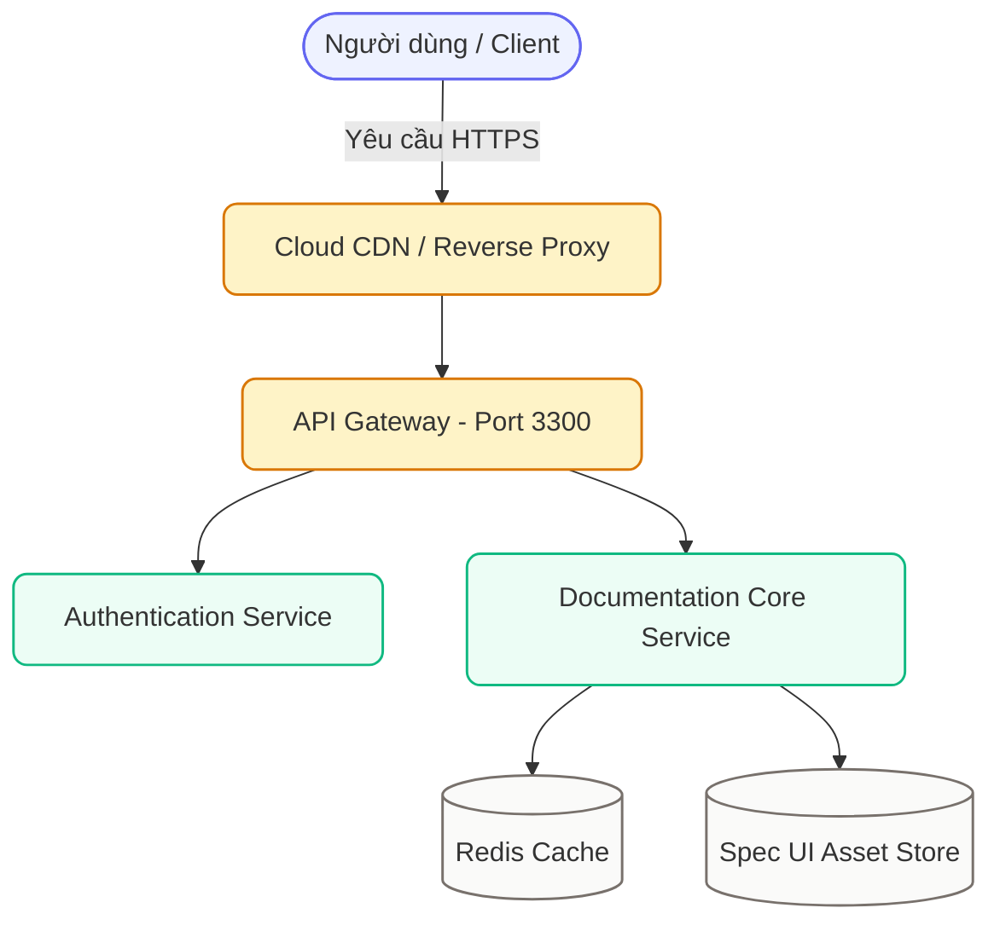

# Hệ Thống Thiết Kế Đặc Tả — Spec UI System

Chào mừng bạn đến với **System Spec UI System** — Cổng tài liệu đặc tả kiến trúc, thiết kế kỹ thuật và API được chuẩn hóa theo phong cách hiện đại. Đây là bộ công cụ hoàn chỉnh, độc lập (Zero-Dependency) kết hợp giữa sức mạnh của **Docsify**, hệ thống **Design Tokens kem ấm**, bộ lọc **Mermaid Auto-Sanitizer**, **Smart Diagram Toolbar** và **Fullscreen Modal chuẩn Figma/Miro**.

---

## Tổng Hợp Nâng Cấp Kỹ Thuật Vượt Trội

| Tiêu chí                 | Bản Gốc Ban Đầu                                                                        | Bản Đã Nâng Cấp Hoàn Thiện                                                                                                 |
| :----------------------- | :------------------------------------------------------------------------------------- | :------------------------------------------------------------------------------------------------------------------------- |
| **Khởi chạy Local**      | Dùng `docsify-cli` (thường crash lỗi `Cannot find module 'ansi-colors'`).              | **Zero-Dependency Server** (`serve.cjs` thuần Node.js hoặc `bun`, không cần `node_modules`).                               |
| **Live Reload Tự Động**  | Phải nhấn F5 / reload thủ công mỗi lần sửa Markdown hoặc CSS.                          | **Zero-Dependency Live Reload**: Tự động reload trình duyệt qua SSE ngay khi lưu file, giữ nguyên hash URL.                |
| **Vẽ Sơ Đồ Mermaid**     | Lỗi icon quả bom `Syntax error in text` trên hầu hết sơ đồ phức tạp.                   | **100% sơ đồ hiển thị hoàn hảo**, có bộ lọc Auto-Sanitizer khử xung đột plugin.                                            |
| **Xung đột Plugin Copy** | Plugin Copy-Code chèn chữ "Sao chépLỗiĐã sao chép!" vào mã sơ đồ gây gãy cú pháp.      | **Auto-Sanitizer**: Tự động bóc tách sạch sẽ các button và Prism code trước khi render.                                    |
| **Hiển thị Khung Sơ Đồ** | Bị lỗi Flexbox căn giữa: lề trái bị đẩy âm (-638px), chữ hai bên bị cắt cụt vĩnh viễn. | **Fit-to-Frame 100%**: Sơ đồ tự co vừa khít khung thẻ Spec UI, không bao giờ bị cắt.                                       |
| **Xem Chi Tiết Sơ Đồ**   | Không có cách nào phóng to; sơ đồ lớn chữ bị lí tí hoặc bị tràn mất nội dung.          | **Thanh Toolbar Sơ Đồ**: Cho phép chuyển đổi 1-click giữa Vừa khung và Kích thước gốc 1:1. Hỗ trợ nhấp đúp (Double-Click). |
| **Xem Toàn Màn Hình**    | Không hỗ trợ.                                                                          | **Fullscreen Modal** tương tác cao cấp chuẩn Figma/Miro: cuộn chuột zoom, kéo chuột lia (Pan).                             |
| **Biểu Tượng Chuẩn Hóa** | Lạm dụng emoji hoạt hình khiến UI mang cảm giác "AI Slop".                             | **Tabler Icons (Webfont CDN)**: Icon nét thanh tinh tế, đồng nhất 24x24, chỉ dùng cho mục đích công năng.                  |
| **Tương tác Bàn Phím**   | Không có.                                                                              | **Hỗ trợ phím tắt chuyên nghiệp**: `Esc` (Đóng), `+` / `-` (Zoom), `0` (Reset vừa khung).                                  |

---

## Danh Mục Tài Liệu Kỹ Thuật

Tài liệu được phân chia thành các phần chi tiết trong thanh điều hướng bên trái:

- **[01. Design Tokens](01-design-tokens/colors-and-typography.md)**: Hệ thống bảng màu chuẩn, Font chữ Lora + Be Vietnam Pro, và khoảng cách Spacing Tokens.
- **[02. Thành Phần Đặc Tả (Components)](02-components/ui-components.md)**: Các khối thông tin phân cấp (Callout), HTTP Method Badges, Migration Status Labels, Bảng đặc tả I/O và Docsify-Tabs.
- **[03. Sơ Đồ Thực Tế (Mermaid Templates)](03-diagram-templates/mermaid-gallery.md)**: Bộ sưu tập 5 mẫu sơ đồ Mermaid thực chiến (Use Case, 3-Layer Architecture, AWS Deployment, WebSocket Sequence, OTP Activity).
- **[04. AI Ruleset v1.7](04-ai-ruleset/ruleset-and-prompts.md)**: Bộ quy tắc bắt buộc dành cho AI khi sinh mã đặc tả kỹ thuật.
- **[Cẩm Nang Master Prompt Phân Tích Codebase](AI-SPEC-WRITER-GUIDE.md)**: Hướng dẫn dành cho người dùng và AI để tự động quét bất kỳ codebase nào và tạo cổng tài liệu tương tự.

---

## Trải Nghiệm Nhanh Các Thành Phần Đặc Tả

### 1. Hộp Thông Tin Phân Cấp (Callout Boxes)

<div class="callout info">
  <i class="ti ti-info-circle"></i> <strong>Thông tin:</strong> Máy chủ tài liệu chạy độc lập không cần cài đặt thêm thư viện ngoài (Zero-dependency).
</div>

<div class="callout success">
  <i class="ti ti-circle-check"></i> <strong>Tối ưu:</strong> 100% sơ đồ Mermaid được tự động khử xung đột và co vừa vặn khung thẻ card.
</div>

<div class="callout warning">
  <i class="ti ti-alert-triangle"></i> <strong>Lưu ý quan trọng:</strong> Luôn sử dụng thẻ <code>&lt;div class="diagram-wrapper"&gt;</code> bao quanh khối Mermaid để kích hoạt thanh công cụ Toolbar và Fullscreen Modal.
</div>

<div class="callout danger">
  <i class="ti ti-alert-circle"></i> <strong>Cảnh báo bảo mật:</strong> Tuyệt đối không lưu trữ khóa bí mật API hoặc chứng chỉ mật khẩu trong kho mã nguồn công khai.
</div>

### 2. HTTP Method Badges & Nhãn Trạng Thái

- Phương thức HTTP: <span class="badge get">GET</span> <span class="badge post">POST</span> <span class="badge put">PUT</span> <span class="badge patch">PATCH</span> <span class="badge delete">DELETE</span>
- Nhãn trạng thái: <span class="status-label stable">Hoạt động tốt</span> <span class="status-label review">Đang rà soát</span> <span class="status-label draft">Bản nháp</span> <span class="status-label deprecated">Bị loại bỏ</span>

### 3. Sơ Đồ Tương Tác Trực Quan

Thử nghiệm di chuột lên sơ đồ bên dưới để thấy thanh **Toolbar (Xem kích thước gốc / Toàn màn hình)** hoặc **nhấp đúp chuột** để phóng to:



<div class="diagram-caption">Sơ đồ 1: Luồng kiến trúc điều phối dịch vụ của hệ thống Spec UI</div>

---

## Hướng Dẫn Khởi Chạy Local

Chạy máy chủ độc lập tích hợp sẵn:

```bash
node serve.cjs
# hoặc nếu dùng Bun:
bun serve.cjs
# hoặc dùng npm:
npm start
```

Mở trình duyệt truy cập: **[http://localhost:3300](http://localhost:3300)**

> [!TIP]
> **Tính năng Live Reload**: Đã được kích hoạt mặc định qua Server-Sent Events (SSE). Mỗi khi bạn lưu file `.md`, `.css` hoặc `.js`, trình duyệt sẽ tự động tải lại mà vẫn giữ nguyên URL hash đang xem. Nếu muốn tắt Live Reload để chạy chế độ tĩnh thuần túy:
>
> ```bash
> $env:LIVE_RELOAD="false"; node serve.cjs
> # hoặc trên Linux/macOS:
> LIVE_RELOAD=false node serve.cjs
> ```

---

## Áp Dụng Sang Dự Án Mới (3 Bước)

1. **Bước 1**: Copy toàn bộ repository này vào thư mục `docs/` của dự án mới của bạn.
2. **Bước 2**: Mở trợ lý AI (Cursor / Claude / ChatGPT) và dán câu lệnh từ tệp [`AI-SPEC-WRITER-GUIDE.md`](AI-SPEC-WRITER-GUIDE.md):
   > _"Hãy đọc tệp AI-SPEC-WRITER-GUIDE.md, khảo sát toàn bộ codebase dự án này, phân rã kiến trúc thành các Domain Bounded Contexts, và viết chi tiết từng chương tài liệu theo đúng chuẩn Spec UI."_
3. **Bước 3**: Chạy `node docs/serve.cjs` để mở cổng tài liệu tại **http://localhost:3300**!
