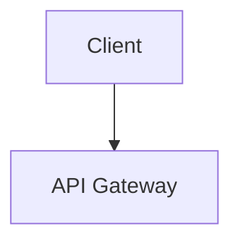

# Rule: Spec UI Components Specification (`spec-components`)

> **Quy tắc bất biến**: Khi tạo các phần tử giao diện trong tài liệu Markdown, Agent bắt buộc phải sử dụng các component HTML chuẩn đã được định nghĩa trong `custom.css`. Tuyệt đối không sử dụng inline styles (`style="..."`).

---

## 1. Hộp Thông Báo & Cảnh Báo (Callout Boxes)

Cấu trúc chuẩn của hộp Callout trong hệ thống Spec UI:

```html
<div class="callout info"><i class="ti ti-info-circle"></i> <strong>Thông tin:</strong> Nội dung chi tiết của ghi chú hoặc cấu hình.</div>

<div class="callout success">
  <i class="ti ti-circle-check"></i> <strong>Tối ưu hóa:</strong> Nội dung khuyến nghị thực hành tốt nhất (Best Practices).
</div>

<div class="callout warning">
  <i class="ti ti-alert-triangle"></i> <strong>Lưu ý logic ngầm:</strong> Cảnh báo rủi ro kỹ thuật, điều kiện rẽ nhánh, rate limiting.
</div>

<div class="callout danger">
  <i class="ti ti-alert-circle"></i> <strong>Nguy cơ bảo mật:</strong> Cảnh báo nguy cơ mất dữ liệu, breaking changes, lỗ hổng bảo mật.
</div>
```

### Bảng Tra Cứu Các Biến Thể Callout:

| Class CSS          | Icon Tabler Đi Kèm                     | Mục Đích Sử Dụng                                                                |
| :----------------- | :------------------------------------- | :------------------------------------------------------------------------------ |
| `.callout.info`    | `<i class="ti ti-info-circle"></i>`    | Thông tin bổ trợ kiến trúc, giải thích tham số, cấu hình port/môi trường.       |
| `.callout.success` | `<i class="ti ti-circle-check"></i>`   | Khuyến nghị thực hành tốt, tối ưu hiệu năng, SLA đạt được.                      |
| `.callout.warning` | `<i class="ti ti-alert-triangle"></i>` | Logic ngầm, edge cases, validation ẩn, điều kiện khóa tài khoản/rate-limit.     |
| `.callout.danger`  | `<i class="ti ti-alert-circle"></i>`   | Lỗ hổng bảo mật, nguy cơ thất thoát dữ liệu, race conditions, breaking changes. |

---

## 2. Huy Hiệu Phương Thức HTTP (HTTP Method Badges)

Được sử dụng trong các bảng đặc tả API Endpoints:

```html
<span class="badge get">GET</span>
<span class="badge post">POST</span>
<span class="badge put">PUT</span>
<span class="badge delete">DELETE</span>
<span class="badge patch">PATCH</span>
```

---

## 3. Nhãn Trạng Thái Tính Năng (Status Labels)

Dùng để đánh dấu tình trạng module hoặc vòng đời tài liệu:

```html
<span class="status-label stable">Hoạt động ổn định</span>
<span class="status-label review">Đang rà soát</span>
<span class="status-label draft">Bản nháp / Cần xác minh</span>
<span class="status-label deprecated">Không sử dụng / Bị loại bỏ</span>
```

---

## 4. Bảng Đặc Tả Kỹ Thuật (Tech Tables)

Sử dụng định dạng Markdown Table chuẩn kết hợp với các cột canh lề rõ ràng:

- Cột Tên tham số/trường: Căn trái (`:---`), bọc tên biến trong backticks (`` `param` ``).
- Cột Bắt buộc / Tùy chọn: Căn giữa (`:---:`), sử dụng `<span class="required-star">*</span>` nếu là trường bắt buộc.
- Cột Kiểu dữ liệu & Mặc định: Căn trái.
- Cột Mô tả & Ràng buộc: Căn trái, giải thích rõ ngữ nghĩa và điều kiện validation.

Ví dụ:

```markdown
| Tham số     | Kiểu dữ liệu |                Bắt buộc                 | Mặc định | Mô tả & Ràng buộc                             |
| :---------- | :----------- | :-------------------------------------: | :------- | :-------------------------------------------- |
| `username`  | `string`     | Có<span class="required-star">\*</span> | -        | Định danh đăng nhập, 4-32 ký tự alphanumeric. |
| `is_active` | `boolean`    |                  Không                  | `true`   | Trạng thái kích hoạt tài khoản.               |
```

---

## 5. Định Dạng Sơ Đồ Mermaid (Mermaid Wrapper)

- **Cơ chế tự động của Docsify**: Trình biên dịch trong `index.html` đã được cấu hình tự động bọc thẻ `<div class="diagram-wrapper"><pre class="mermaid">` quanh mọi khối mã ` ```mermaid `.
- Do đó, khi viết trong Markdown, Agent chỉ cần dùng khối mã chuẩn:

````markdown

````

- Không cần tự viết thêm thẻ `<div class="diagram-wrapper">` bọc ngoài khối mã markdown để tránh bị lồng thẻ hai lớp.

---

## 6. Biểu Tượng Công Năng (Tabler Icons)

- Sử dụng cú pháp Tabler Icons Webfont: `<i class="ti ti-[tên-icon]"></i>`.
- **Nguyên tắc "Non-AI"**: Tuyệt đối không dùng emoji hoạt hình trong tiêu đề (H1, H2, H3) hoặc làm icon trang trí. Chỉ dùng icon Tabler cho mục đích công năng thực sự (trong Callout, nút bấm, bảng trạng thái).
